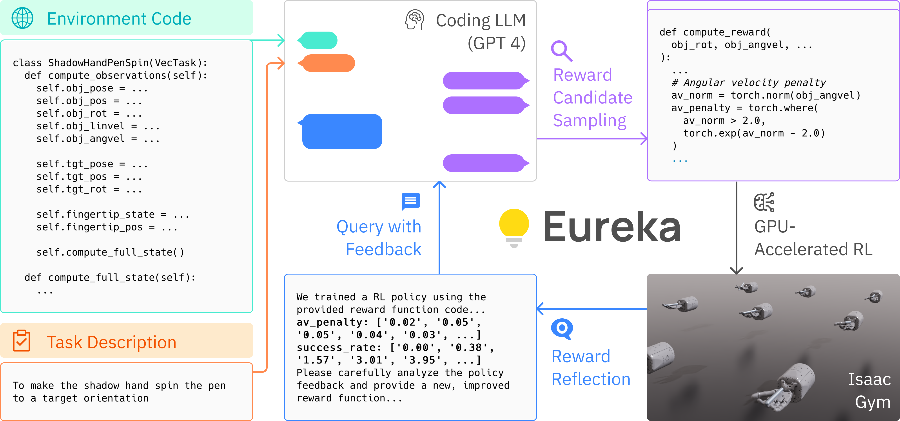

# Eureka: Human-Level Reward Design via Coding Large Language Models

<div align="center">

[[Website]](https://eureka-research.github.io)
[[arXiv]](https://arxiv.org/abs/2310.12931)
[[PDF]](https://eureka-research.github.io/assets/eureka_paper.pdf)

[](https://github.com/eureka-research/Eureka)
[](https://pytorch.org/)
[](https://github.com/eureka-research/Eureka/blob/main/LICENSE)
______________________________________________________________________

https://github.com/eureka-research/Eureka/assets/21993118/1abb960d-321a-4de9-b311-113b5fc53d4a



</div>

Large Language Models (LLMs) have excelled as high-level semantic planners for sequential decision-making tasks. However, harnessing them to learn complex low-level manipulation tasks, such as dexterous pen spinning, remains an open problem. We bridge this fundamental gap and present Eureka, a **human-level** reward design algorithm powered by LLMs. Eureka exploits the remarkable zero-shot generation, code-writing, and in-context improvement capabilities of state-of-the-art LLMs, such as GPT-4, to perform in-context evolutionary optimization over reward code. The resulting rewards can then be used to acquire complex skills via reinforcement learning. Eureka generates reward functions that outperform expert human-engineered rewards without any task-specific prompting or pre-defined reward templates. In a diverse suite of 29 open-source RL environments that include 10 distinct robot morphologies, Eureka outperforms human expert on **83\%** of the tasks leading to an average normalized improvement of **52\%**. The generality of Eureka also enables a new gradient-free approach to reinforcement learning from human feedback (RLHF), readily incorporating human oversight to improve the quality and the safety of the generated rewards in context. Finally, using Eureka rewards in a curriculum learning setting, we demonstrate for the first time a simulated five-finger Shadow Hand capable of performing pen spinning tricks, adeptly manipulating a pen in circles at human speed. 

# Installation
Eureka requires Python ≥ 3.8. We have tested on Ubuntu 20.04 and 22.04.

1. Create a new conda environment with:
    ```
    conda create -n eureka python=3.8
    conda activate eureka
    ```

2. Install IsaacGym (tested with `Preview Release 4/4`). Follow the [instruction](https://developer.nvidia.com/isaac-gym) to download the package.
```	
tar -xvf IsaacGym_Preview_4_Package.tar.gz
cd isaacgym/python
pip install -e .
(test installation) python examples/joint_monkey.py
```

3. Install Eureka
```
git clone https://github.com/eureka-research/Eureka.git
cd Eureka; pip install -e .
cd isaacgymenvs; pip install -e .
cd ../rl_games; pip install -e .
```

4. Eureka currently uses OpenAI API for language model queries. You need to have an OpenAI API key to use Eureka [here](https://platform.openai.com/account/api-keys)/. Then, set the environment variable in your terminal
```
export OPENAI_API_KEY= "YOUR_API_KEY"
```

# Getting Started

Navigate to the `eureka` directory and run:
```
python eureka.py env={environment} iteration={num_iterations} sample={num_samples}
```
- `{environment}` is the task to perform. Options are listed in `eureka/cfg/env`.
- `{num_samples}` is the number of reward samples to generate per iteration. Default value is `16`.
- `{num_iterations}` is the number of Eureka iterations to run. Default value is `5`.


Below are some example commands to try out Eureka:
```
python eureka.py env=shadow_hand sample=4 iteration=2 model=gpt-4-0314
```
```
python eureka.py env=humanoid sample=16 iteration=5 model=gpt-3.5-turbo-16k-0613
```
Each run will create a timestamp folder in `eureka/outputs` that saves the Eureka log as well as all intermediate reward functions and associated policies.

Other command line parameters can be found in `eureka/cfg/config.yaml`. The list of supported environments can be found in `eureka/cfg/env`.

# Eureka Pen Spinning Demo
We have released Eureka pen spinning policy in `isaacgymenvs/isaacgymenvs/checkpoints`. Try visualizing it with the following command:
```
cd isaacgymenvs/isaacgymenvs
python train.py test=True headless=False force_render=True task=ShadowHandSpin checkpoint=checkpoints/EurekaPenSpinning.pth
```
Note that this script use the default Isaac Gym renderer and not the Omniverse rendering in the paper videos.

# Running Eureka on a New Environment
1. Create a new IsaacGym environment; instructions can be found in [here](isaacgymenvs/docs/framework.md).
2. Verify that standard RL works for your new environment.
```
cd isaacgymenvs/isaacgymenvs
python train.py task=YOUR_NEW_TASK
```
3. Create a new yaml file `your_new_task.yaml` in `eureka/cfg/env`:
```
env_name: your_new_task
task: YOUR_NEW_TASK 
description: ...
```
4. Construct the raw environment code that will serve as context for Eureka as well as the skeleton environment code on which the Eureka reward will be appended to:
```
cd eureka/utils
python prune_env.py your_new_task
```

5. Try out Eureka!
```
python eureka.py env=your_new_task
```

# Acknowledgement
We thank the following open-sourced projects:
- Our environments are from [IsaacGym](https://github.com/NVIDIA-Omniverse/IsaacGymEnvs) and [DexterousHands](https://github.com/PKU-MARL/DexterousHands/).
- Our RL training code is based on [rl_games](https://github.com/Denys88/rl_games).


# License
This codebase is released under [MIT License](LICENSE).

# Citation
If you find our work useful, please consider citing us!

```bibtex
@article{ma2023eureka,
  title   = {Eureka: Human-Level Reward Design via Coding Large Language Models},
  author  = {Yecheng Jason Ma and William Liang and Guanzhi Wang and De-An Huang and Osbert Bastani and Dinesh Jayaraman and Yuke Zhu and Linxi Fan and Anima Anandkumar},
  year    = {2023},
  journal = {arXiv preprint arXiv: Arxiv-2310.12931}
}
```

Disclaimer: This project is strictly for research purposes, and not an official product from NVIDIA.

