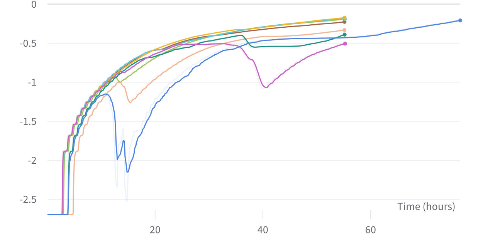

DeXtreme is our recent work on transferring cube rotation with allegro hand from simulations to the real world. This task is especially challenging due to increased number of contacts that come into play with doing physics simulation. Naturally, the transfer requires carefully modelling and scheduling the randomisation for both physics and non-physics parameters. More details of the work can be found on the website https://dextreme.org/ as well as the paper (accepted at ICRA 2023, London) available on arXiv https://arxiv.org/pdf/2210.13702.pdf.


The work builds on top of our previously released `AllegroHand` environment but with changes to accomodate training for sim-to-real involving two different variants: ManualDR (where the ranges  of parameter domain randomisation are chosen by the user manually) and Automatic Domain Randomisation or ADR (where the ranges of the parameter are updated automatically based on periodic simulation performance benchmarking in the loop). 

Overview 
--------

There are two different classes **AllegroHandDextremeManualDR** and **AllegroHandDextremeADR** both located in [tasks/dextreme/allegro_hand_dextreme.py](../isaacgymenvs/tasks/dextreme/allegro_hand_dextreme.py) python file. There's additional [adr_vec_task.py](../isaacgymenvs/tasks/dextreme/adr_vec_task.py) located in the same [folder](../isaacgymenvs/tasks/dextreme/) that covers the necessary code related to training with ADR in the `ADRVecTask` class. 

Both the variants are trained with `Asymmetric Actor-Critic` where the `policy` only receives the input that is available in the real world while the `value function` receives additional privileged information available from the simulator. At inference, only the policy is used to obtain the action given the history of states and value function is discarded. For more information, please look at `Section 2` of the DeXtreme paper.

As we will show below, both environments are compatible with the standard way of training with Isaac Gym via `python train.py task=<AllegroHandDextremeManualDR or AllegroHandDextremeADR>`. Additionally, the code uses `dictionary observations` enabled via `use_dict_obs=True` (set as default for these enviornments) in the `ADRVecTask` where the relevant observations needed for training are provided as dictionaries as opposed to filling in the data via slicing and indexing. This keeps it cleaner and easier to manage. Which observations to choose for the policy and value function can be described in the corresponding `yaml` files for training located in `cfg/train` folder. For instance, the policy in the [AllegroHandDextremeManualDRPPO.yaml](../isaacgymenvs/cfg/train/AllegroHandDextremeManualDRPPO.yaml) can be described below like 

```
    inputs:

      dof_pos_randomized: { }
      object_pose_cam_randomized: { }
      goal_pose_randomized: { }
      goal_relative_rot_cam_randomized: { }
      last_actions_randomized: { }
```
Similarly, for the value function

``` network:
        name: actor_critic
        central_value: True

        inputs:
          dof_pos: { }
          dof_vel: { }
          dof_force: { }

          object_pose: { }
          object_pose_cam_randomized: { }
          object_vels: { }

          goal_pose: { }
          goal_relative_rot: {}

          last_actions: { }

          ft_force_torques: {}
          gravity_vec: {}
          ft_states: {}
```

Similar configuration set up is done for [AllegroHandDextremeADRPPO.yaml](../isaacgymenvs/cfg/train/AllegroHandDextremeManualDRPPO.yaml).

Various parameters that the user wishes to randomise for their training can be chosen and tuned in the corresponding `task` files located in `cfg/task` [folder](../isaacgymenvs/cfg/task/). For instance, in [AllegroHandDextremeManualDR.yaml](../isaacgymenvs/cfg/task/AllegroHandDextremeManualDR.yaml), the randomisation parameters and ranges can be found under 

```
task:
  randomize: True
  randomization_params:
    ....
```

For the [AllegroHandDextremeADR.yaml](../isaacgymenvs/cfg/task/AllegroHandDextremeADR.yaml), additional configuration is needed and can be found under 

```
  adr:

    use_adr: True

    # set to false to not do update ADR ranges. useful for evaluation or training a base policy
    update_adr_ranges: True 
    ...


    # raw ADR params. more are added by affine transforms code
    params:
      ### Hand Properties
      hand_damping:
        range_path: actor_params.hand.dof_properties.damping.range
        init_range: [0.5, 2.0]
        limits: [0.01, 20.0]
        delta: 0.01
        delta_style: 'additive'
```

You will also see that there are two key variables: `limits` and `delta`. The variable `limits` refers to the complete range within which the parameter is permitted to move, while `delta` represents the incremental change that the parameter can undergo with each ADR update. These variables play a crucial role in determining the scope and pace of parameter adjustments made by ADR.


We highly recommend to familiarise yourself with the codebase and configuration files first before training to understand the relevant classes and the inheritence involved. 

Below we provide the exact settings for training the two different variants of the environment we used in our work for reproducibility.

# To run experiments with Manual DR settings

If you are using a single GPU, run the following command to train DeXtreme RL policies with Manual DR

```
HYDRA_MANUAL_DR="train.py multi_gpu=False \
task=AllegroHandDextremeManualDR \
task.env.resetTime=8 task.env.successTolerance=0.4 \
experiment='allegrohand_dextreme_manual_dr' \
headless=True seed=-1 \
task.env.startObjectPoseDY=-0.15 \
task.env.actionDeltaPenaltyScale=-0.2 \
task.env.resetTime=8 \
task.env.controlFrequencyInv=2 \
train.params.network.mlp.units=[512,512] \
train.params.network.rnn.units=768 \
train.params.network.rnn.name=lstm \
train.params.config.central_value_config.network.mlp.units=[1024,512,256] \
train.params.config.max_epochs=50000 \
task.env.apply_random_quat=True"


python ${HYDRA_MANUAL_DR}
```

The `apply_random_quat=True` flag samples unbiased quaternion goals which makes the training slightly harder. We use a successTolerance of 0.4 radians in these settings overriding the settings in AllegroHandDextremeManualDR.yaml via hydra CLI.

# To run experiments with Automatic Domain Randomisation (ADR)

The ADR policies are trained with a successTolerance of 0.1 radians and use LSTMs both for policy as well as value function. For ADR on a single GPU, run the following commands to train the RL policies 

```
HYDRA_ADR="train.py multi_gpu=False \
task=AllegroHandDextremeADR \
headless=True seed=-1 \
num_envs=8192 \
task.env.resetTime=8 \
task.env.controlFrequencyInv=2 \
train.params.config.max_epochs=50000"

python ${HYDRA_ADR}
```

If you want to do `wandb_logging` you can also add the following to the `HYDRA_MANUAL_DR` 

```
wandb_activate=True wandb_group=group_name wandb_project=project_name"
```

To log the entire isaacgymenvs code used to train in the wandb dashboard (this is useful for reproducibility as you make changes to your code) you can add: 

```
wandb_logcode_dir=<isaac_gym_dir>
```

# Loading checkpoints

To load a given checkpoint using ManualDR, you can use the following  


```
python train.py task=AllegroHandDextremeManualDR \
num_envs=32 task.env.startObjectPoseDY=-0.15 \
task.env.actionDeltaPenaltyScale=-0.2 \
task.env.controlFrequencyInv=2 train.params.network.mlp.units=[512,512] \
train.params.network.rnn.units=768 \
train.params.network.rnn.name=lstm \
train.params.config.central_value_config.network.mlp.units=[1024,512,256] \
task.env.random_network_adversary.enable=True checkpoint=<ckpt_path> \
test=True task.env.apply_random_quat=True task.env.printNumSuccesses=False

```

and for ADR, add `task.task.adr.adr_load_from_checkpoint=True` to the command above, i.e.

```
python train.py task=AllegroHandDextremeADR \
num_envs=2048 checkpoint=<your_checkpoint_path> \
test=True \
task.task.adr.adr_load_from_checkpoint=True \
task.env.printNumSuccesses=True \
headless=True
```

It will also print statistics and create a new `eval_summaries` directory logging the performance for test in a tensorboard log. For the ADR testing, it is will also load the new adr parameters (they are saved in the checkpoint and can also be viewed in the `set_env_state` function in `allegro_hand_dextreme.py`). You should see something like this when you load a checkpoint with ADR 

```
=> loading checkpoint 'your_checkpoint_path'
Loaded env state value act_moving_average:0.183225
Skipping loading ADR params from checkpoint...
ADR Params after loading from checkpoint: {'hand_damping': {'range_path': 'actor_params.hand.dof_properties.damping.range',
 'init_range': [0.5, 2.0], 'limits': [0.01, 20.0], 'delta': 0.01, 'delta_style': 'additive', 'range': [0.5, 2.0], 
 'next_limits': [0.49, 2.01]}, 'hand_stiffness': {'range_path': 'actor_params.hand.dof_properties.stiffness.range', 
 'init_range': [0.8, 1.2], 'limits': [0.01, 20.0], 'delta': 0.01, 'delta_style': 'additive', 'range': [0.8, 1.2], 
 'next_limits': [0.79, 1.21]}, 'hand_joint_friction': {'range_path': 'actor_params.hand.dof_properties.friction.range', 
 'init_range': [0.8, 1.2], 'limits': [0.0, 10.0], 'delta': 0.01, 'delta_style': 'additive', 'range': [0.8, 1.2], 
 'next_limits': [0.79, 1.21]}, 'hand_armature': {'range_path': 'actor_params.hand.dof_properties.armature.range', 
 'init_range': [0.8, 1.2], 'limits': [0.0, 10.0], 'delta': 0.01, 'delta_style': 'additive', 'range': [0.8, 1.2], 
 'next_limits': [0.79, 1.21]}, 'hand_effort': {'range_path': 'actor_params.hand.dof_properties.effort.range', 
 'init_range': [0.9, 1.1], 'limits': [0.4, 10.0], 'delta': 0.01, 'delta_style': 'additive', 'range': [0.9, 1.1], 
 'next_limits': [0.89, 1.11]}, 'hand_lower': {'range_path': 'actor_params.hand.dof_properties.lower.range', 
 'init_range': [0.0, 0.0], 'limits': [-5.0, 5.0], 'delta': 0.02, 'delta_style': 'additive', 'range': [0.0, 0.0], 
 'next_limits': [-0.02, 0.02]}, 'hand_upper': {'range_path': 'actor_params.hand.dof_properties.upper.range', 
 'init_range': [0.0, 0.0], 'limits': [-5.0, 5.0], 'delta': 0.02, 'delta_style': 'additive', 'range': [0.0, 0.0], 
 'next_limits': [-0.02, 0.02]}, 'hand_mass': {'range_path': 'actor_params.hand.rigid_body_properties.mass.range', 
 'init_range': [0.8, 1.2], 'limits': [0.01, 10.0], 'delta': 0.01, 'delta_style': 'additive', 'range': [0.8, 1.2], 
 'next_limits': [0.79, 1.21]}, 'hand_friction_fingertips': {'range_path': 'actor_params.hand.rigid_shape_properties.friction.range', 'init_range': [0.9, 1.1], 'limits': [0.1, 2.0], 'delta': 0.01, 'delta_style': 'additive', 'range': [0.9, 1.1], 
 'next_limits': [0.89, 1.11]}, 'hand_restitution': {'range_path': 'actor_params.hand.rigid_shape_properties.restitution.range', 
 'init_range': [0.0, 0.1], 'limits': [0.0, 1.0], 'delta': 0.01, 'delta_style': 'additive', 'range': [0.0, 0.1],
 'next_limits': [0.0, 0.11]}, 'object_mass': {'range_path': 'actor_params.object.rigid_body_properties.mass.range', 
 'init_range': [0.8, 1.2], 'limits': [0.01, 10.0], 'delta': 0.01, 'delta_style': 'additive', 'range': [0.8, 1.2], 
 'next_limits': [0.79, 1.21]}, 'object_friction': {'range_path': 'actor_params.object.rigid_shape_properties.friction.range',
 'init_range': [0.4, 0.8], 'limits': [0.01, 2.0], 'delta': 0.01, 'delta_style': 'additive', 'range': [0.4, 0.8], 
 'next_limits': [0.39, 0.81]}, 'object_restitution': {'range_path': 'actor_params.object.rigid_shape_properties.restitution.range', 'init_range': [0.0, 0.1], 'limits': [0.0, 1.0], 'delta': 0.01, 'delta_style': 'additive', 'range': [0.0, 0.1], 
 'next_limits': [0.0, 0.11]}, 'cube_obs_delay_prob': {'init_range': [0.0, 0.05], 'limits': [0.0, 0.7], 'delta': 0.01, 'delta_style': 'additive', 'range': [0.0, 0.05], 'next_limits': [0.0, 0.060000000000000005]}, 'cube_pose_refresh_rate':
 {'init_range': [1.0, 1.0], 'limits': [1.0, 6.0], 'delta': 0.2, 'delta_style': 'additive', 'range': [1.0, 1.0], 
 'next_limits': [1.0, 1.2]}, 'action_delay_prob': {'init_range': [0.0, 0.05], 'limits': [0.0, 0.7], 'delta': 0.01, 
 'delta_style': 'additive', 'range': [0.0, 0.05], 'next_limits': [0.0, 0.060000000000000005]}, 
 'action_latency': {'init_range': [0.0, 0.0], 'limits': [0, 60], 'delta': 0.1, 'delta_style': 'additive', 'range': [0.0, 0.0], 
 'next_limits': [0, 0.1]}, 'affine_action_scaling': {'init_range': [0.0, 0.0], 'limits': [0.0, 4.0], 'delta': 0.0, 
 'delta_style': 'additive', 'range': [0.0, 0.0], 'next_limits': [0.0, 0.0]}, 'affine_action_additive': {'init_range': [0.0, 0.04], 
 'limits': [0.0, 4.0], 'delta': 0.01, 'delta_style': 'additive', 'range': [0.0, 0.04], 'next_limits': [0.0, 0.05]}, 
 'affine_action_white': {'init_range': [0.0, 0.04], 'limits': [0.0, 4.0], 'delta': 0.01, 'delta_style': 'additive', 
 'range': [0.0, 0.04], 'next_limits': [0.0, 0.05]}, 'affine_cube_pose_scaling': {'init_range': [0.0, 0.0], 
 'limits': [0.0, 4.0], 'delta': 0.0, 'delta_style': 'additive', 'range': [0.0, 0.0], 'next_limits': [0.0, 0.0]}, 
 'affine_cube_pose_additive': {'init_range': [0.0, 0.04], 'limits': [0.0, 4.0], 'delta': 0.01, 'delta_style': 
 'additive', 'range': [0.0, 0.04], 'next_limits': [0.0, 0.05]}, 'affine_cube_pose_white': {'init_range': [0.0, 0.04], 
 'limits': [0.0, 4.0], 'delta': 0.01, 'delta_style': 'additive', 'range': [0.0, 0.04], 'next_limits': [0.0, 0.05]}, 
 'affine_dof_pos_scaling': {'init_range': [0.0, 0.0], 'limits': [0.0, 4.0], 'delta': 0.0, 'delta_style': 'additive', 
 'range': [0.0, 0.0], 'next_limits': [0.0, 0.0]}, 'affine_dof_pos_additive': {'init_range': [0.0, 0.04], 
 'limits': [0.0, 4.0], 'delta': 0.01, 'delta_style': 'additive', 'range': [0.0, 0.04], 'next_limits': [0.0, 0.05]}, 
 'affine_dof_pos_white': {'init_range': [0.0, 0.04], 'limits': [0.0, 4.0], 'delta': 0.01, 'delta_style': 
 'additive', 'range': [0.0, 0.04], 'next_limits': [0.0, 0.05]}, 'rna_alpha': {'init_range': [0.0, 0.0], 
 'limits': [0.0, 1.0], 'delta': 0.01, 'delta_style': 'additive', 'range': [0.0, 0.0], 'next_limits': [0.0, 0.01]}}
```

# Multi-GPU settings 

If you want to train on multiple GPUs (or a single DGX node), we also provide training scripts and the code to run both Manual DR as well as ADR below. The ${GPUS} variable needs to be set beforehand in your bash e.g. GPUS=8 if you are using a single node. Throughout our experimentation for the DeXtreme work, We trained our policies on a single node containg 8 NVIDIA A40 GPUs.

# Manual DR 

To run the training with Manual DR settings on Multi-GPU settings set the flag `multi_gpu=True`. You will also need to add the following to the previous Manual DR command:

```
torchrun --nnodes=1 --nproc_per_node=${GPUS} --master_addr '127.0.0.1' ${HYDRA_MANUAL_DR} 
```

# ADR 

Similarly for ADR:

```
torchrun --nnodes=1 --nproc_per_node=${GPUS} --master_addr '127.0.0.1' ${HYDRA_ADR}
```

Below, we show the npd (nats per dimension cf. Algorithm 5.2 [OpenAI et al. 2019](https://arxiv.org/pdf/1910.07113.pdf) and Section 2.6.3 [DeXtreme](https://arxiv.org/pdf/2210.13702.pdf)) graphs of two batches of 8 different trials each run on a single node (8 GPUs) across different weeks. Each of these plots are meant to highlight the variability in the runs. Increase in npd means the networks are being trained on more divesity.




## RL training

To try the exact version of rl_games we used for training our experiments, please git clone and install `https://github.com/ArthurAllshire/rl_games`
