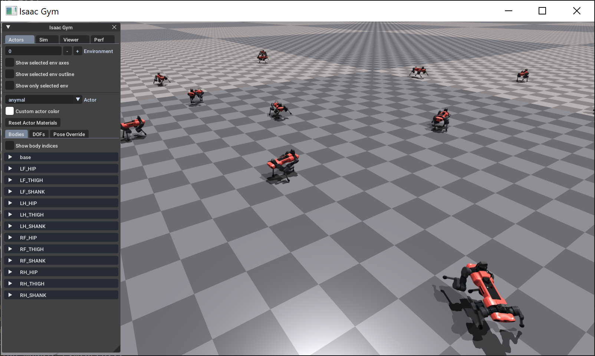
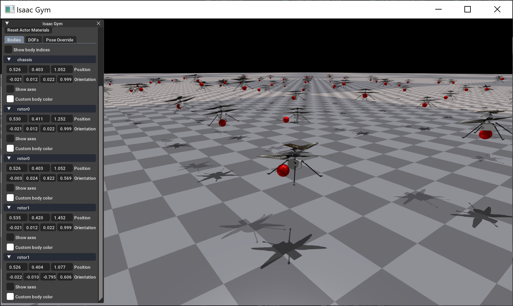
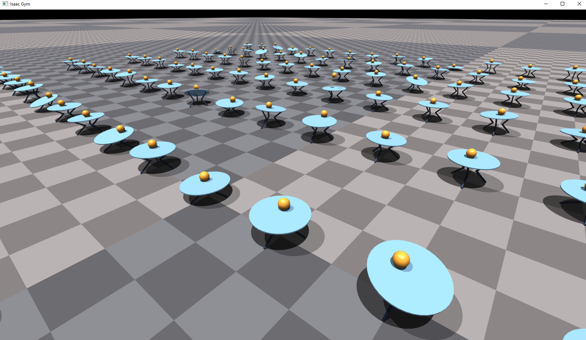
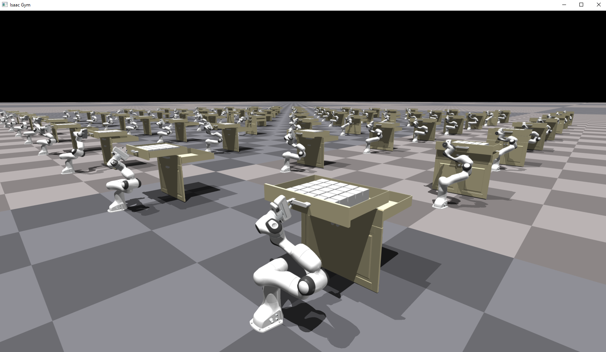
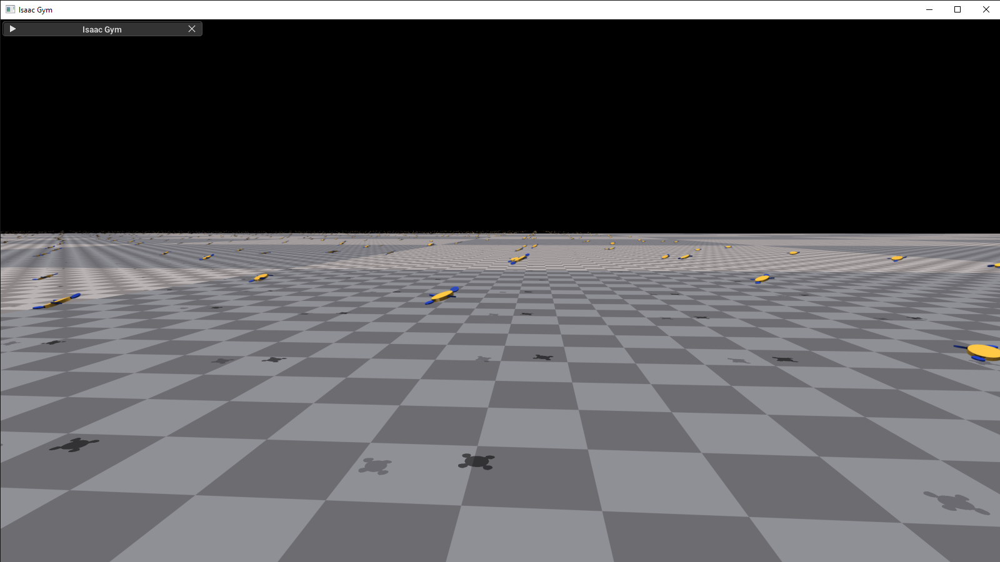

Reinforcement Learning Examples
===============================

Single-gpu training reinforcement learning examples can be launched from
`isaacgymenvs` with `python train.py`.

When training with the viewer (not headless), you can press `v` to toggle
viewer sync. Disabling viewer sync will improve performance, especially
in GPU pipeline mode. Viewer sync can be re-enabled at any time to check
training progress.

List of Examples
----------------

* [Ant](#ant-antpy)
* [Humanoid](#humanoid-humanoidpy)
* [Shadow Hand](#shadow-hand-object-manipulation-shadow_handpy)
* [Allegro Hand](#allegro-hand-allegro_handpy)
* [ANYmal](#anymal-anymalpy)
* [ANYmal Rough Terrain](#anymal-rough-terrain-anymal_terrainpy)
* [TriFinger](#trifinger-trifingerpy)
* [NASA Ingenuity Helicopter](#nasa-ingenuity-helicopter-ingenuitypy)
* [Cartpole](#cartpole-cartpolepy)
* [Ball Balance](#ball-balance-ball_balancepy)
* [Franka Cabinet](#franka-cabinet-franka_cabinetpy)
* [Franka Cube Stack](#franka-cube-stack-franka_cube_stackpy)
* [Quadcopter](#quadcopter-quadcopterpy)
* [Adversarial Motion Priors](#amp-adversarial-motion-priors-humanoidamppy)
* [Factory](#factory-fast-contact-for-robotic-assembly)
* [DeXtreme](#dextreme-transfer-of-agile-in-hand-manipulation-from-simulation-to-reality)

### Ant [ant.py](../isaacgymenvs/tasks/ant.py)

An example of a simple locomotion task, the goal is to train quadruped
robots (ants) to run forward as fast as possible. The Ant task includes
examples of utilizing Isaac Gym's actor root state tensor, DOF state
tensor, and force sensor tensor APIs. Actor root states provide data for
the ant's root body, including position, rotation, linear and angular
velocities. This information can be used to detect whether the ant has
been moving towards the desired direction and whether it has fallen or
flipped over. DOF states are used to retrieve the position and velocity
of each DOF for the ant, and force sensors are used to indicate contacts
with the ground plane on the ant's legs.

Actions are applied onto the DOFs of the ants to allow it to move, using
the `set_dof_actuation_force_tensor` API.

During resets, we also show usage of
`set_actor_root_state_tensor_indexed` and `set_dof_state_tensor_indexed`
APIs for setting select ants into a valid starting state.

It can be launched with command line argument `task=Ant`.

Config files used for this task to train with PPO are:

-   **Task config**: [Ant.yaml](../isaacgymenvs/cfg/task/Ant.yaml)
-   **rl_games training config**: [AntPPO.yaml](../isaacgymenvs/cfg/train/AntPPO.yaml)

With SAC:

-   **Task config**: [AntSAC.yaml](../isaacgymenvs/cfg/task/AntSAC.yaml)
-   **rl_games training config**: [AntSAC.yaml](../isaacgymenvs/cfg/train/AntSAC.yaml)

 

### Humanoid [humanoid.py](../isaacgymenvs/tasks/humanoid.py)

The humanoid example is conceptually very similar to the Ant task. In
this example, we also use actor root states to detect whether humanoids
are been moving towards the desired direction and whether they have
fallen. DOF states are used to retrieve the position and velocity of
each DOF for the humanoids, and force sensors are used to indicate
contacts with the ground plane on the humanoids' feet.

It can be launched with command line argument `task=Humanoid`.

Config files used for this task to train with PPO are:

-   **Task config**: [Humanoid.yaml](../isaacgymenvs/cfg/task/Humanoid.yaml)
-   **rl_games training config**: [HumanoidPPO.yaml](../isaacgymenvs/cfg/train/HumanoidPPO.yaml)

With SAC:

-   **Task config**: [HumanoidSAC.yaml](../isaacgymenvs/cfg/task/HumanoidSAC.yaml)
-   **rl_games training config**: [HumanoidSAC.yaml](../isaacgymenvs/cfg/train/HumanoidSAC.yaml)


### Shadow Hand Object Manipulation [shadow_hand.py](../isaacgymenvs/tasks/shadow_hand.py)

The Shadow Hand task is an example of a challenging dexterity
manipulation task with complex contact dynamics. It resembles OpenAI's
[Learning Dexterity](https://openai.com/blog/learning-dexterity/)
project and [Robotics Shadow
Hand](https://github.com/openai/gym/tree/master/gym/envs/robotics)
training environments. It also demonstrates the use of tendons in the
Shadow Hand model. In this example, we use `get_asset_tendon_properties`
and `set_asset_tendon_properties` to get and set tendon properties for
the hand. Motion of the hand is controlled using position targets with
`set_dof_position_target_tensor`.

The goal is to orient the object in the hand to match the target
orientation. There is a goal object that shows the target orientation to
be achieved by the manipulated object. To reset both the target object
and the object in hand, it is important to make **one** single call to
`set_actor_root_state_tensor_indexed` to set the states for both
objects. This task has 3 difficulty levels using different objects to
manipulate - block, egg and pen and different observations schemes -
`openai`, `full_no_vel`, `full` and `full_state` that can be set in the
task config in `observationType` field. Moreover it supports asymmetric
observations, when policy and value functions get different sets of
observation.

The basic version of the task can be launched with command line argument `task=ShadowHand`.

Config files used for this task are:

-   **Task config**: [ShadowHand.yaml](../isaacgymenvs/cfg/task/ShadowHand.yaml)
-   **rl_games training config**: [ShadowHandPPO.yaml](../isaacgymenvs/cfg/train/ShadowHandPPO.yaml)

Observations types:

-   **openai**: fingertip positions, object position and relative to the
    goal object orientation. These are the same set of observations as used in
    the OpenAI [Learning Dexterity](https://openai.com/blog/learning-dexterity/) project
-   **full_no_vel**: the same as `full` but without any velocity
    information for joints, object and fingertips
-   **full**: a standard set of observations with joint positions and
    velocities, object pose, linear and angular velocities, the goal
    pose and fingertip transforms, and their linear and angular
    velocities
-   **full_state**: `full` set of observations plus readings from
    force-torque sensors attached to the fingertips and joint forces
    sensors. This is the default used by the base **ShadowHand** task

#### OpenAI Variant

In addition to the basic version of this task, there is an additional variant matching OpenAI's [Learning Dexterity](https://openai.com/blog/learning-dexterity/) project.
This variant uses the **openai** observations in the policy network, but asymmetric observations of the **full_state** in the value network.
This can be launched with command line argument `task=ShadowHandOpenAI_FF`.

Config files used for this are:

-   **Task config**: [ShadowHandOpenAI_FF.yaml](../isaacgymenvs/cfg/task/ShadowHandOpenAI_FF.yaml)
-   **rl_games training config**: [ShadowHandOpenAI_FFPPO.yaml](../isaacgymenvs/cfg/train/ShadowHandOpenAI_FFPPO.yaml).


#### LSTM Training Variants

There are two other variants of training 

-   [ShadowHandOpenAI_LSTM](../isaacgymenvs/cfg/train/ShadowHandOpenAI_LSTMPPO.yaml)
    -   This variant uses LSTM policy and value networks instead of
        feed forward networks, and also asymmetric LSTM critic designed for the OpenAI variant of the task.
    - This can be launched with command line argument `task=ShadowHandOpenAI_LSTM`.
-   [ShadowHand_LSTM](../isaacgymenvs/cfg/train/ShadowHandPPOLSTM.yaml)
    -   This variant uses LSTM policy and value networks instead of
        feed forward networks, but unlike the previous config, uses symmetric observations for the standard variant of Shadow Hand.
    - This can be launched with command line argument `task=ShadowHand train=ShadowHandPPOLSTM`.

#### OpenAI Testing Variant

This is a testing variant of the config to match test conditions from the Learning Dexterity paper such as a longer episode time and not re-applying 
domain randomizations after initial randomization. It is not intended to be used for training. Note that if the successTolerance config option is changed to 0.1 during training,
running the testing variant with the standard 0.4 successTolerance will show improved performance. The testing variant will also output the average number of 
consecutive successes to the console, showing both the direct average of all environments as well as the average only over environments that have finished.
Over time these numbers should converge. 

To test the FF OpenAI variant, use these arguments: `task=ShadowHandTest train=ShadowHandOpenAI_FFPPO test=True checkpoint=<CHECKPOINT_TO_LOAD>`.

To test the LSTM OpenAI variant, use these arguments: `task=ShadowHandTest train=ShadowHandOpenAI_LSTMPPO test=True checkpoint=<CHECKPOINT_TO_LOAD>`.

-   **Task config**: [ShadowHandOpenTest.yaml](../isaacgymenvs/cfg/task/ShadowHandTest.yaml)


### Allegro Hand [allegro_hand.py](../isaacgymenvs/tasks/allegro_hand.py)

This example performs the same cube manipulation task as the Shadow Hand environment, but using the Allegro hand instead of the Shadow hand.

It can be launched with command line argument `task=AllegroHand`.

Config files used for this task are:

-   **Task config**: [AllegroHand.yaml](../isaacgymenvs/cfg/task/AllegroHand.yaml)
-   **rl_games training config**: [AllegroHandPPO.yaml](../isaacgymenvs/cfg/train/AllegroHandPPO.yaml)


### Anymal [anymal.py](../isaacgymenvs/tasks/anymal.py)

This example trains a model of the ANYmal quadruped robot from ANYbotics
to follow randomly chosen x, y, and yaw target velocities.

It can be launched with command line argument `task=Anymal`.

Config files used for this task are:

-   **Task config**: [Anymal.yaml](../isaacgymenvs/cfg/task/Anymal.yaml)
-   **rl_games training config**: [AnymalPPO.yaml](../isaacgymenvs/cfg/train/AnymalPPO.yaml)



### Anymal Rough Terrain [anymal_terrain.py](../isaacgymenvs/tasks/anymal_terrain.py)

A highly upgraded version of the original Anymal environment which supports
traversing rough terrain and sim2real.

It can be launched with command line argument `task=AnymalTerrain`.

-   **Task config**: [AnymalTerrain.yaml](../isaacgymenvs/cfg/task/AnymalTerrain.yaml)
-   **rl_games training config**: [AnymalTerrainPPO.yaml](../isaacgymenvs/cfg/train/AnymalTerrainPPO.yaml)

**Note** during test time use the last weights generated, rather than the usual best weights. 
Due to curriculum training, the reward goes down as the task gets more challenging, so the best weights
do not typically correspond to the best outcome.

**Note** if you use the ANYmal rough terrain environment in your work, please ensure you cite the following work:
```
@misc{rudin2021learning,
      title={Learning to Walk in Minutes Using Massively Parallel Deep Reinforcement Learning}, 
      author={Nikita Rudin and David Hoeller and Philipp Reist and Marco Hutter},
      year={2021},
      journal = {arXiv preprint arXiv:2109.11978}
```
**Note** The IsaacGymEnvs implementation slightly differs from the implementation used in the paper above, which also
uses a different RL library and PPO implementation. The original implementation will be made available [here](https://github.com/leggedrobotics/legged_gym). Results reported in the Isaac Gym technical paper are based on that repository, not this one.

### Trifinger [trifinger.py](../isaacgymenvs/tasks/trifinger.py)

The [Trifinger](isaacgymenvs/tasks/trifinger.py) environment is modelled on the [Real Robot Challenge 2020](https://real-robot-challenge.com/2020).
The goal is to move the cube to the desired target location, which is represented by a superimposed cube.

It can be launched with command line argument `task=Trifinger`.

-   **Task config**: [Trifinger.yaml](../isaacgymenvs/cfg/task/Trifinger.yaml)
-   **rl_games training config**: [TrifingerPPO.yaml](../isaacgymenvs/cfg/train/Trifinger.yaml)


**Note** if you use the Trifinger environment in your work, please ensure you cite the following work:
```
@misc{isaacgym-trifinger,
  title     = {{Transferring Dexterous Manipulation from GPU Simulation to a Remote Real-World TriFinger}},
  author    = {Allshire, Arthur and Mittal, Mayank and Lodaya, Varun and Makoviychuk, Viktor and Makoviichuk, Denys and Widmaier, Felix and Wuthrich, Manuel and Bauer, Stefan and Handa, Ankur and Garg, Animesh},
  year      = {2021},
  journal = {arXiv preprint arXiv:2108.09779},
}
```

### NASA Ingenuity Helicopter [ingenuity.py](../isaacgymenvs/tasks/ingenuity.py)

This example trains a simplified model of NASA's Ingenuity helicopter to navigate to a moving target.
It showcases the use of velocity tensors and applying force vectors to rigid bodies.
Note that we are applying force directly to the chassis, rather than simulating aerodynamics.
This example also demonstrates using different values for gravitational forces, as well as dynamically writing a physics model from Python code at runtime.
Ingenuity Helicopter visual 3D Model courtesy of NASA: https://mars.nasa.gov/resources/25043/mars-ingenuity-helicopter-3d-model/.

It can be launched with command line argument `task=Ingenuity`.

Config files used for this task are:

-   **Task config**: [Ingenuity.yaml](../isaacgymenvs/cfg/task/Ingenuity.yaml)
-   **rl_games training config**: [IngenuityPPO.yaml](../isaacgymenvs/cfg/train/IngenuityPPO.yaml)



### Cartpole [cartpole.py](../isaacgymenvs/tasks/cartpole.py)

Cartpole is a simple example that shows usage of the DOF state tensors. Position and velocity data are used as observation for the cart and pole DOFs. Actions are applied as forces to the cart using `set_dof_actuation_force_tensor`. During reset, we use `set_dof_state_tensor_indexed` to set DOF position and velocity of the cart and pole to a randomized state.

It can be launched with command line argument `task=Cartpole`.

Config files used for this task are:

-   **Task config**: [Cartpole.yaml](../isaacgymenvs/cfg/task/Cartpole.yaml)
-   **rl_games training config**: [CartpolePPO.yaml](../isaacgymenvs/cfg/train/CartpolePPO.yaml)


### Ball Balance [ball_balance.py](../isaacgymenvs/tasks/ball_balance.py)

This example trains balancing tables to balance a ball on the table top.
This is a great example to showcase the use of force and torque sensors, as well as DOF states for the table and root states for the ball. In this example, the three-legged table has a force sensor attached to each leg using the `create_force_sensor` API. We use the force sensor tensor APIs to collect force and torque data on the legs, which guide position target outputs produced by the policy. The example shows usage of `set_dof_position_target_tensor` to set position targets to keep the ball balanced on the table.

It can be launched with command line argument `task=BallBalance`.

Config files used for this task are:

-   **Task config**: [BallBalance.yaml](../isaacgymenvs/cfg/task/BallBalance.yaml)
-   **rl_games training config**: [BallBalancePPO.yaml](../isaacgymenvs/cfg/train/BallBalancePPO.yaml)



### Franka Cabinet [franka_cabinet.py](../isaacgymenvs/tasks/franka_cabinet.py)

The Franka example demonstrates interaction between Franka arm and cabinet, as well as setting states of objects inside the drawer.
It also showcases control of the Franka arm using position targets.
In this example, we use DOF state tensors to retrieve the state of the Franka arm, as well as the state of the drawer on the cabinet.
Actions are applied using `set_dof_position_target_tensor` to set position targets for the Franka arm DOFs.

During reset, we use indexed versions of APIs to reset Franka, cabinet, and objects inside drawer to their initial states. `set_actor_root_state_tensor_indexed` is used to reset objects inside drawer, `set_dof_position_target_tensor_indexed` is used to reset Franka, and `set_dof_state_tensor_indexed` is used to reset Franka and cabinet.

It can be launched with command line argument `task=FrankaCabinet`.

Config files used for this task are:

-   **Task config**: [FrankaCabinet.yaml](../isaacgymenvs/cfg/task/FrankaCabinet.yaml)
-   **rl_games training config**: [FrankaCabinetPPO.yaml](../isaacgymenvs/cfg/train/FrankaCabinetPPO.yaml)



### Franka Cube Stack [franka_cube_stack.py](../isaacgymenvs/tasks/franka_cube_stack.py)

The Franka Cube Stack example shows solving a cube stack task using either operational space control (OSC) or joint space torque control.
OSC control provides an example of using direct GPU mass-matrix access API.

It can be launched with command line argument `task=FrankaCubeStack`.

Config files used for this task are:

-   **Task config**: [FrankaCubeStack.yaml](../isaacgymenvs/cfg/task/FrankaCubeStack.yaml)
-   **rl_games training config**: [FrankaCubeStackPPO.yaml](../isaacgymenvs/cfg/train/FrankaCubeStackPPO.yaml)


### Quadcopter [quadcopter.py](../isaacgymenvs/tasks/quadcopter.py)

This example trains a very simple quadcopter model to reach and hover near a fixed position.  The quadcopter model is generated procedurally and doesn't actually include any rotating blades.  Lift is achieved by applying thrust forces to the "rotor" bodies, which are modeled as flat cylinders.  This is a good example of using LOCAL_SPACE forces.  In addition to thrust, the pitch and roll of each rotor is controlled using DOF position targets.

It can be launched with command line argument `task=Quadcopter`.

Config files used for this task are:

-   **Task config**: [Quadcopter.yaml](../isaacgymenvs/cfg/task/Quadcopter.yaml)
-   **rl_games training config**: [QuadcopterPPO.yaml](../isaacgymenvs/cfg/train/QuadcopterPPO.yaml)




### AMP: Adversarial Motion Priors [HumanoidAMP.py](../isaacgymenvs/tasks/humanoid_amp.py)

This example trains a simulated human model to imitate different pre-recorded human animations stored in the mocap data - walking, running and backflip.

It can be launched with command line argument `task=HumanoidAMP`. The Animation file to train with can be set with `motion_file` in the task config (also see below for more information). Note: in test mode the viewer camera follows the humanoid from the first env. This can be changed in the environment yaml config by setting `cameraFollow=False`, or on the command line with a hydra override as follows: `++task.env.cameraFollow=False

A few motions from the CMU motion capture library (http://mocap.cs.cmu.edu/) are included with this repository, but additional animations can be converted from FBX into a trainable format using the poselib `fbx_importer.py`. You can learn more about poselib and this conversion tool in `isaacgymenvs/tasks/amp/poselib/README.md`

Several animations from the SFU Motion Capture Database (https://mocap.cs.sfu.ca/) are known to train well, including ones for martial arts moves such as a spin-kick, walking, jogging, and running animations, and several dance captures. The spinning kick portion of the SFU 0017_WushuKicks001 (shown below) trains in 6 minutes on a GA100 GPU. The SFU motions are not included directly in this repository due to licensing restrictions.

Config files used for this task are:

-   **Task config**: [HumanoidAMP.yaml](../isaacgymenvs/cfg/task/HumanoidAMP.yaml)
-   **rl_games training config**: [HumanoidAMPPPO.yaml](../isaacgymenvs/cfg/train/HumanoidPPOAMP.yaml)
-   **mocap data**: [motions](../assets/amp/motions)

**Note** When training using new motion clips, the single most important hyperparameter to tune for AMP is `disc_grad_penalty` in `HumanoidAMPPPO.yaml`. Typical values are between [0.1, 10]. For a new motion, start with large values first, and if the policy is not able to closely imitate the motion, then try smaller coefficients for the gradient penalty. The `HumanoidAMPPPOLowGP.yaml` training configuration is provided as a convenience for this purpose.

Use the following command lines for training the currently included AMP motions:  
(Walk is the default config motion, so doesn't need the motion file specified)  
`python train.py task=HumanoidAMP experiment=AMP_walk`  
`python train.py task=HumanoidAMP ++task.env.motion_file=amp_humanoid_run.npy experiment=AMP_run`  
`python train.py task=HumanoidAMP ++task.env.motion_file=amp_humanoid_dance.npy experiment=AMP_dance`

(Backflip and Hop require the LowGP training config)  
`python train.py task=HumanoidAMP train=HumanoidAMPPPOLowGP ++task.env.motion_file=amp_humanoid_backflip.npy experiment=AMP_backflip`  
`python train.py task=HumanoidAMP train=HumanoidAMPPPOLowGP ++task.env.motion_file=amp_humanoid_hop.npy experiment=AMP_hop`  

(Cartwheel requires hands in the contact body list and the LowGP training config; the default motion for the HumanoidAMPHands task is Cartwheel)
`python train.py task=HumanoidAMPHands train=HumanoidAMPPPOLowGP experiment=AMP_cartwheel`

**Note** If you use the AMP: Adversarial Motion Priors environment in your work, please ensure you cite the following work:
```
@article{
	2021-TOG-AMP,
	author = {Peng, Xue Bin and Ma, Ze and Abbeel, Pieter and Levine, Sergey and Kanazawa, Angjoo},
	title = {AMP: Adversarial Motion Priors for Stylized Physics-Based Character Control},
	journal = {ACM Trans. Graph.},
	issue_date = {August 2021},
	volume = {40},
	number = {4},
	month = jul,
	year = {2021},
	articleno = {1},
	numpages = {15},
	url = {http://doi.acm.org/10.1145/3450626.3459670},
	doi = {10.1145/3450626.3459670},
	publisher = {ACM},
	address = {New York, NY, USA},
	keywords = {motion control, physics-based character animation, reinforcement learning},
} 
```

Images below are from SFU SpinKick training.


### Factory: Fast Contact for Robotic Assembly
There are 5 Factory example tasks: **FactoryTaskNutBoltPick**, **FactoryTaskNutBoltPlace**, **FactoryTaskNutBoltScrew**, **FactoryTaskNutBoltInsertion**, and **FactoryTaskNutBoltGears**. Like the other tasks, they can be executed with `python train.py task=<task_name>`. The first time you run these examples, it may take some time for Gym to generate SDFs for the assets. However, these SDFs will then be cached.

**FactoryTaskNutBoltPick**, **FactoryTaskNutBoltPlace**, and **FactoryTaskNutBoltScrew** train policies for the Pick, Place, and Screw tasks. They are simplified versions of the corresponding tasks in the Factory paper (e.g., smaller randomization ranges, simpler reward formulations, etc.) The Pick and Place subpolicies may take ~1 hour to achieve high success rates on a modern GPU, and the Screw subpolicy, which does not include initial state randomization, should achieve high success rates almost immediately.

**FactoryTaskNutBoltInsertion** and **FactoryTaskNutBoltGears** do not train RL policies by default, as successfully training these policies is an open area of research. Their associated scripts ([factory_task_insertion.py](../isaacgymenvs/tasks/factory/factory_task_insertion.py) and [factory_task_gears.py](../isaacgymenvs/tasks/factory/factory_task_gears.py)) provide templates for users to write their own RL code. For an example of a filled-out template, see the script for **FactoryTaskNutBoltPick** ([factory_task_nut_bolt_pick.py](../isaacgymenvs/tasks/factory/factory_task_nut_bolt_pick.py)).

The general configuration files for the above tasks are [FactoryTaskNutBoltPick.yaml](../isaacgymenvs/cfg/task/FactoryTaskNutBoltPick.yaml), [FactoryTaskNutBoltPlace.yaml](../isaacgymenvs/cfg/task/FactoryTaskNutBoltPlace.yaml), [FactoryTaskNutBoltScrew.yaml](../isaacgymenvs/cfg/task/FactoryTaskNutBoltScrew.yaml), [FactoryTaskInsertion.yaml](../isaacgymenvs/cfg/task/FactoryTaskInsertion.yaml), and [FactoryTaskGears.yaml](../isaacgymenvs/cfg/task/FactoryTaskGears.yaml). Note that you can select low-level controller types (e.g., joint-space IK, task-space impedance) within these configuration files.

The training configuration files for the above tasks are [FactoryTaskNutBoltPickPPO.yaml](../isaacgymenvs/cfg/train/FactoryTaskNutBoltPickPPO.yaml), [FactoryTaskNutBoltPlacePPO.yaml](../isaacgymenvs/cfg/train/FactoryTaskNutBoltPlacePPO.yaml), [FactoryTaskNutBoltScrewPPO.yaml](../isaacgymenvs/cfg/train/FactoryTaskNutBoltScrewPPO.yaml), [FactoryTaskInsertionPPO.yaml](../isaacgymenvs/cfg/train/FactoryTaskInsertionPPO.yaml), and [FactoryTaskGearsPPO.yaml](../isaacgymenvs/cfg/train/FactoryTaskGearsPPO.yaml). We use the [rl-games](https://github.com/Denys88/rl_games) library to train our RL agents via PPO, and these configuration files define the PPO parameters.

We highly recommend reading the [extended documentation](factory.md) for Factory, which will be regularly updated. This documentation includes details on SDF collisions, which all the Factory examples leverage. You can use SDF collisions for your own assets and environments.

If you use the Factory simulation methods (e.g., SDF collisions, contact reduction) or Factory learning tools (e.g., assets, environments, or controllers) in your work, please cite the following paper:
```
@inproceedings{
	narang2022factory,
	author = {Yashraj Narang and Kier Storey and Iretiayo Akinola and Miles Macklin and Philipp Reist and Lukasz Wawrzyniak and Yunrong Guo and Adam Moravanszky and Gavriel State and Michelle Lu and Ankur Handa and Dieter Fox},
	title = {Factory: Fast contact for robotic assembly},
	booktitle = {Robotics: Science and Systems},
	year = {2022}
} 
```

Also note that our original formulations of SDF collisions and contact reduction were developed by [Macklin, et al.](https://dl.acm.org/doi/abs/10.1145/3384538) and [Moravanszky and Terdiman](https://scholar.google.com/scholar?q=Game+Programming+Gems+4%2C+chapter+Fast+Contact+Reduction+for+Dynamics+Simulation), respectively.


### DeXtreme: Transfer of Agile In-hand Manipulation from Simulation to Reality

DeXtreme provides an example of sim-to-real transfer of dexterous manipulation with an Allegro Hand including Automatic Domain Randomization (ADR). You can read further details of the task in the [extended documentation](dextreme.md) and additional information about ADR [here](domain_randomization.md).

There are two [DeXtreme](https://dextreme.org) tasks: **AllegroHandDextremeManualDR** and **AllegroHandDextremeADR**. They are both compatible with the standard way of training in Isaac Gym via `python train.py task=<AllegroHandDextremeManualDR or AllegroHandDextremeADR>`. For reproducibility, we provide the exact settings with which we trained for those environments.

For `AllegroHandDextremeManualDR`, you should use the following command for training 

```
HYDRA_MANUAL_DR="train.py multi_gpu=False \
task=AllegroHandDextremeManualDR \
task.env.resetTime=8 task.env.successTolerance=0.4 \
experiment='allegrohand_dextreme_manual_dr' \
headless=True seed=-1 \
task.env.startObjectPoseDY=-0.15 \
task.env.actionDeltaPenaltyScale=-0.2 \
task.env.resetTime=8 \
task.env.controlFrequencyInv=2 \
train.params.network.mlp.units=[512,512] \
train.params.network.rnn.units=768 \
train.params.network.rnn.name=lstm \
train.params.config.central_value_config.network.mlp.units=[1024,512,256] \
train.params.config.max_epochs=50000 \
task.env.apply_random_quat=True"


python ${HYDRA_MANUAL_DR}
```

**TaskConfig** [AllegroHandDextremeManualDR.yaml](../isaacgymenvs/cfg/task/AllegroHandDextremeManualDR.yaml)

**TrainConfig** [AllegroHandDextremeManualDRPPO.yaml](../isaacgymenvs/cfg/train/AllegroHandDextremeManualDRPPO.yaml)

For `AllegroHandDextremeADR`, you should use the following command for training 

```
HYDRA_ADR="train.py multi_gpu=False \
task=AllegroHandDextremeADR \
headless=True seed=-1 \
num_envs=8192 \
task.env.resetTime=8 \
task.env.controlFrequencyInv=2 \
train.params.config.max_epochs=50000"

python ${HYDRA_ADR}
```


**TaskConfig** [AllegroHandDextremeADR.yaml](../isaacgymenvs/cfg/task/AllegroHandDextremeADR.yaml)

**TrainConfig** [AllegroHandDextremeADRPPO.yaml](../isaacgymenvs/cfg/train/AllegroHandDextremeADRPPO.yaml)


More videos are available at [dextreme.org](https://dextreme.org)

```
@inproceedings{
	handa2023dextreme,
	author = {Ankur Handa, Arthur Allshire, Viktor Makoviychuk, Aleksei Petrenko, Ritvik Singh, Jingzhou Liu, Denys Makoviichuk, Karl Van Wyk, Alexander Zhurkevich, Balakumar Sundaralingam, Yashraj Narang, Jean-Francois Lafleche, Dieter Fox, Gavriel State},
	title = {DeXtreme: Transfer of Agile In-hand Manipulation from Simulation to Reality},
	booktitle = {ICRA},
	year = {2023}
}
```