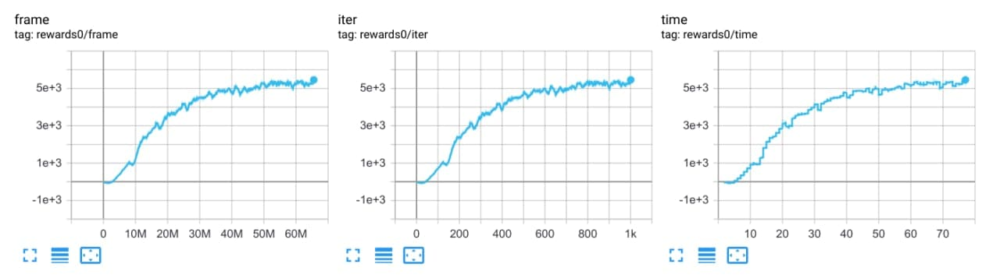
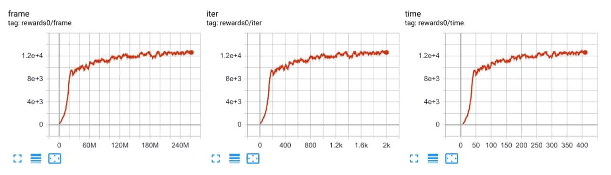
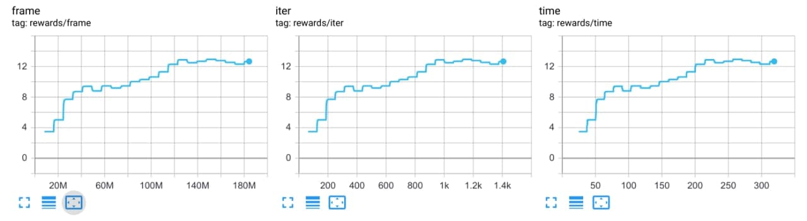
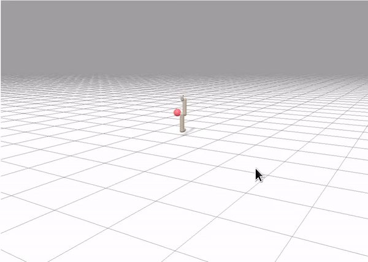

# Brax (https://github.com/google/brax)  

## How to run:  

* **Setup**

```bash
poetry install -E brax
poetry run pip install --upgrade "jax[cuda]==0.3.13" -f https://storage.googleapis.com/jax-releases/jax_releases.html
poetry run pip install torch==1.10.2+cu113 torchvision==0.11.3+cu113 -f https://download.pytorch.org/whl/cu113/torch_stable.html
```

* **Ant** ```poetry run python runner.py --train --file rl_games/configs/brax/ppo_ant.yaml```
* **Humanoid** ```poetry run python runner.py --train --file rl_games/configs/brax/ppo_humanoid.yaml```

## Visualization of the trained policy:  
* **brax_visualization.ipynb**

## Results:  
* **Ant** fps step: 1692066.6 fps total: 885603.1  
  
* **Humanoid** fps step: 1244450.3 fps total: 661064.5  
  
* **ur5e** fps step: 1116872.3 fps total: 627117.0  
  


