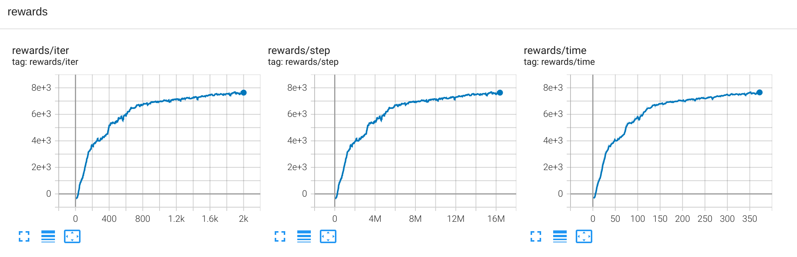
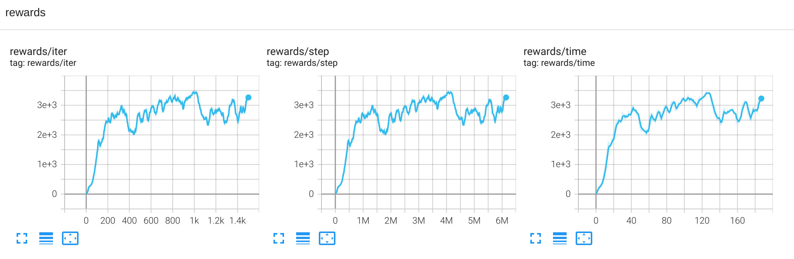
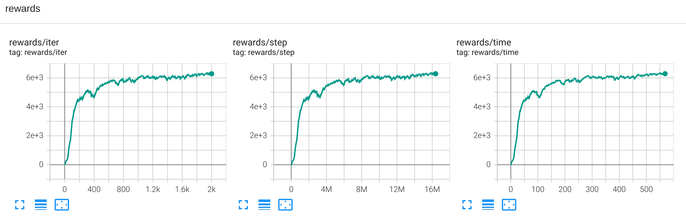
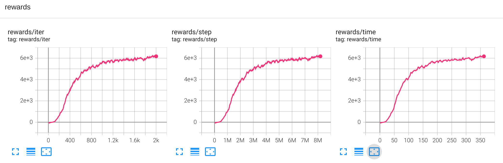
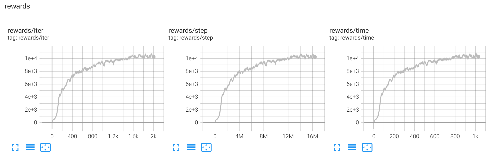

# Mujoco (https://github.com/deepmind/mujoco)  

## How to run:
* **Humanoid** 
```
poetry install -E envpool
poetry run pip install torch==1.11.0+cu113 torchvision==0.12.0+cu113 -f https://download.pytorch.org/whl/cu113/torch_stable.html
poetry run python runner.py --train --file rl_games/configs/mujoco/humanoid_envpool.yaml
```

## Results:
* **HalfCheetah-v4**

* **Hopper-v4**  

* **Walker2d-v4**  

* **Ant-v4**

* **Humanoid-v4**

