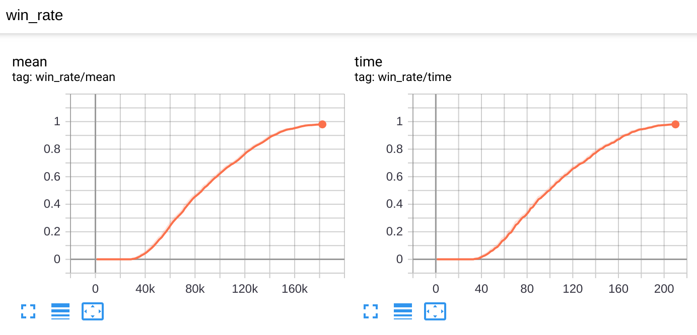
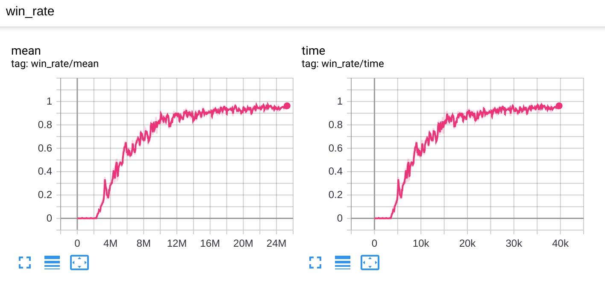
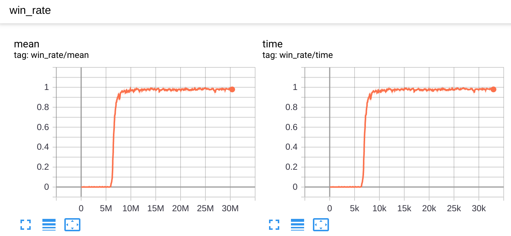
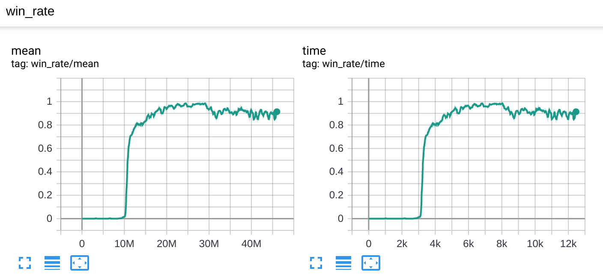
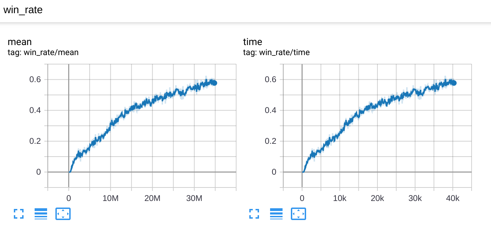
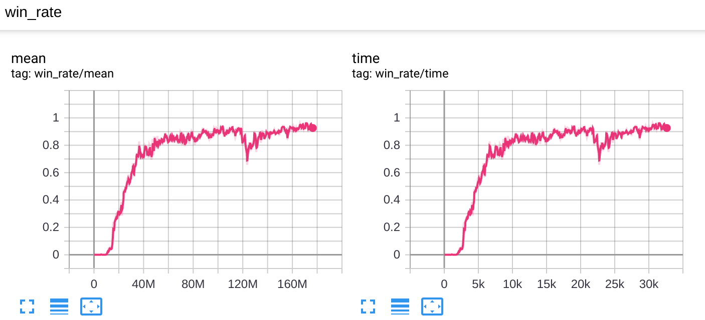

## Starcraft 2 Multiple Agents Results

* Starcraft 2 Multiple Agents Results with PPO (https://github.com/oxwhirl/smac)
* Every agent was controlled independently and has restricted information
* All the environments were trained with a default difficulty level 7
* No curriculum, just baseline PPO
* Full state information wasn't used for critic, actor and critic recieved the same agent observations
* Most results are significantly better by win rate and were trained on a single PC much faster than QMIX (https://arxiv.org/pdf/1902.04043.pdf), MAVEN (https://arxiv.org/pdf/1910.07483.pdf) or QTRAN
* No hyperparameter search
* 4 frames + conv1d actor-critic network
* Miniepoch num was set to 1, higher numbers didn't work
* Simple MLP networks didnot work good on hard envs

[](https://www.youtube.com/watch?v=F_IfFz-s-iQ)

# How to run configs:
# Pytorch
* ```python runner.py --train --file rl_games/configs/smac/3m_torch.yaml```
* ```python runner.py --play --file rl_games/configs/smac/3m_torch.yaml --checkpoint 'nn/3m_cnn'```
# Tensorflow
* ```python runner.py --tf --train --file rl_games/configs/smac/3m_torch.yaml```
* ```python runner.py --tf --play --file rl_games/configs/smac/3m_torch.yaml --checkpoint 'nn/3m_cnn'```
* ```tensorboard --logdir runs```
# Results on some environments:
* 2m_vs_1z took near 2 minutes to achive 100% WR
* corridor took near 2 hours for 95+% WR
* MMM2 4 hours for 90+% WR
* 6h_vs_8z got 82% WR after 8 hours of training
* 5m_vs_6m got 72% WR after 8 hours of training

# Plots:
FPS in these plots is calculated on per env basis except MMM2 (it was scaled by number of agents which is 10), to get a win rate per number of environmental steps info, the same as used in plots in QMIX, MAVEN, QTRAN or Deep Coordination Graphs (https://arxiv.org/pdf/1910.00091.pdf) papers FPS numbers under the horizontal axis should be devided by number of agents in player's team.

* 2m_vs_1z:

* 3s5z_vs_3s6z:

* 3s_vs_5z:

* corridor:

* 5m_vs_6m:

* MMM2:

